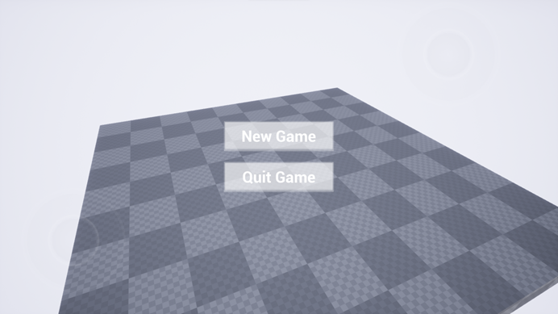
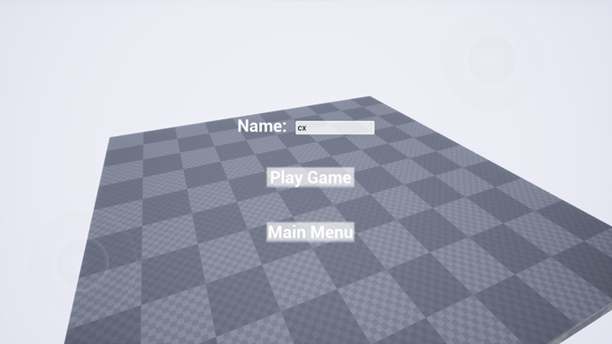
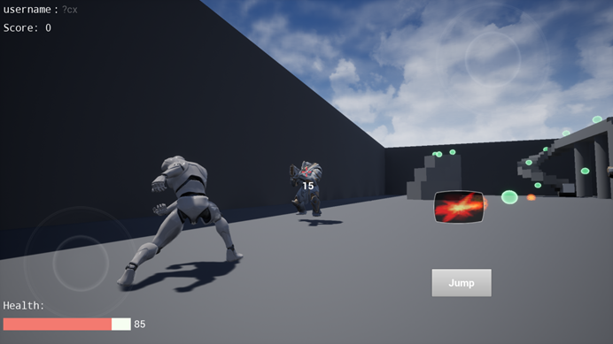
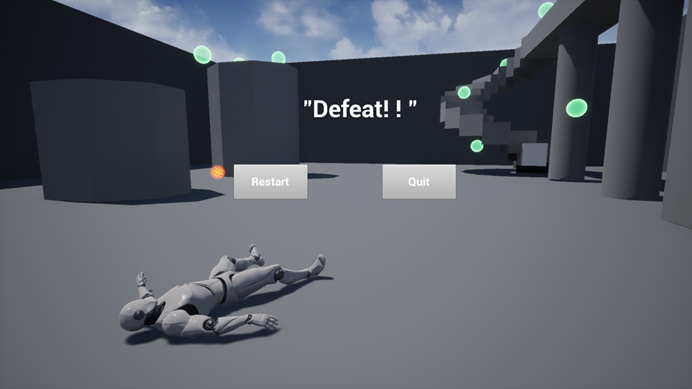
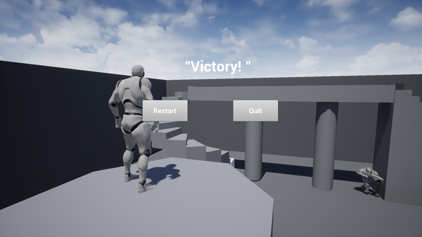
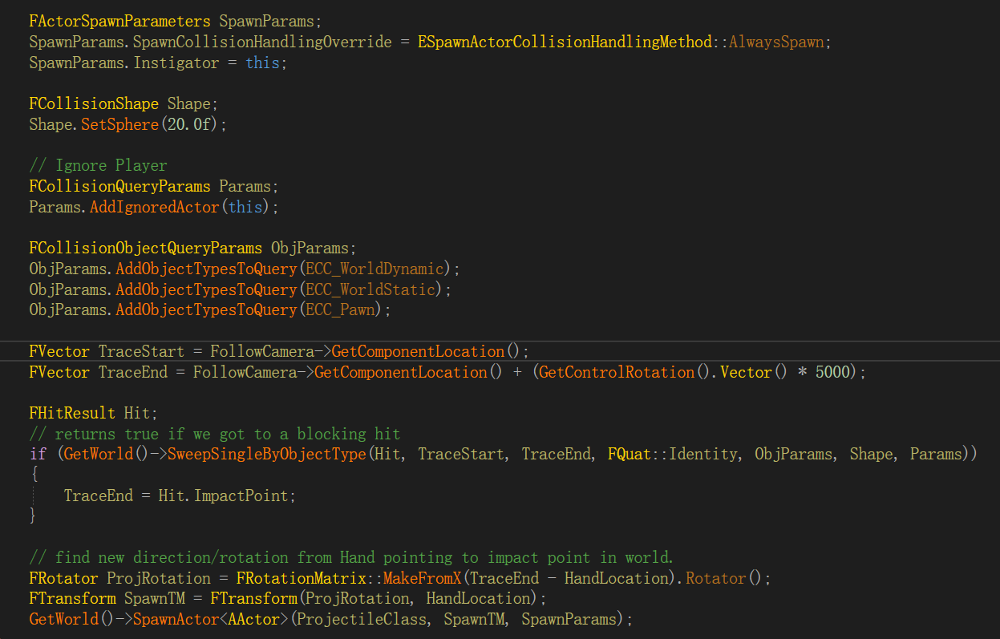
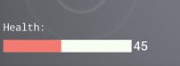
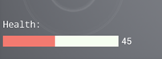
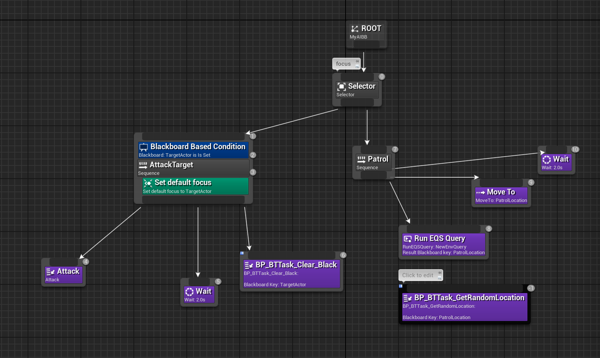

# 游戏介绍

一个简易的“**肉鸽**”类小游戏，在公开课两次作业的基础上，在地图中增加了 **AI 角色**和一些积分球， AI 遇到玩家后会进行攻击，玩家可以**攻击 AI** 将其击杀，当玩家收集完地图中的所有积分球则游戏胜利，如果玩家的血量降低至零则游戏失败。

游戏运行视频微云链接：https://share.weiyun.com/LAcjJGSz

## UI展示

### 主菜单



### 新游戏菜单



### 关卡内界面




### 游戏结束





# 主要功能及实现

## 玩家攻击

### 动画播放

玩家点击鼠标左键或者在安卓程序中点击界面中的”开火“按钮可以进行攻击，点击攻击后会播放一个**Montage动画**，因为需要等玩家的手到达攻击点在发出发射物体，故此处使用了一个**定时器**，会在播放动画后的**AttackAnimDelay(=0.2s)**后发出发射物。

```c++
void AmyGameCharacter::Attack()
{
	PlayAnimMontage(AttackAnim);
	GetWorldTimerManager().SetTimer(TimerHandle_Attack, this, &AmyGameCharacter::Attack_TimeElapsed, AttackAnimDelay);
}
```

### 发射物瞄准：

发射物应该朝屏幕中心十字发射，需要确定发射物的初始位置以及方向。发射物初始位置即为玩家手的位置，而方向需要由发射位置和终点确定，所以在此处使用了碰撞查询来区分发生碰撞与不发生碰撞两种情况对应的终点。




## 积分/生命值变化动画

制作了简单的动画，当玩家的积分或者生命值变化时，数值会短暂增大后再回原来大小。


效果如下：





## AI角色实现

AI的行为树如下图所示，当AI“看”到了玩家后会将“TargetActor”值设置为玩家，并朝玩家发射发射物，玩家被击中会减少一定生命值，AI攻击完玩家后会等待两秒然后“忘记”玩家，然后开始巡逻，直到下一次看见玩家。



